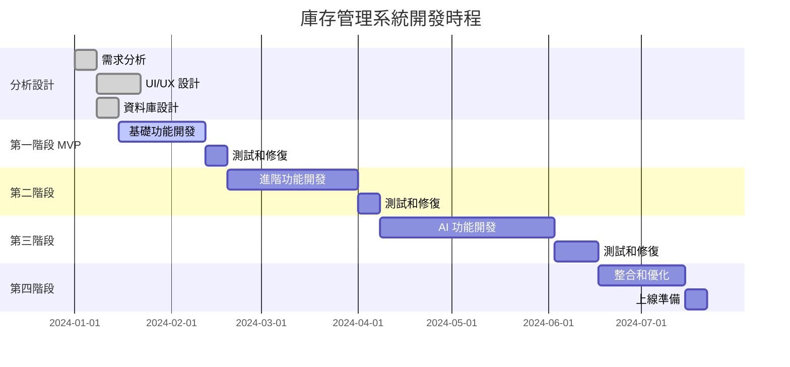

# 📦 TanaPOS v4 AI 庫存管理系統企劃書

## 📋 專案概述

### 專案目標
建立一個智能化的餐廳庫存管理系統，整合現有的 TanaPOS v4 AI 餐廳管理系統，提供完整的採購、庫存、供應商管理功能，並透過 AI 技術優化庫存預測和採購決策。

### 專案範圍
- **範圍內**: 原物料庫存、成品庫存、供應商管理、採購管理、庫存預警、報表分析
- **範圍外**: 會計財務模組、人事薪資系統、客戶關係管理（CRM）

### 目標用戶
- **主要用戶**: 餐廳經理、庫存管理員、採購人員
- **次要用戶**: 廚房主管、店長、老闆

---

## 🎯 核心功能介紹

### 1. 庫存管理 📊
- **即時庫存監控**: 顯示所有原物料和成品的即時庫存量
- **庫存預警系統**: 當庫存低於安全庫存時自動發送通知
- **庫存盤點**: 支援定期盤點和即時盤點功能
- **庫存調整**: 支援入庫、出庫、調撥、報廢等庫存異動
- **庫存追溯**: 完整的庫存異動歷史記錄

### 2. 採購管理 🛒
- **採購計劃**: 根據銷售預測和庫存情況制定採購計劃
- **採購訂單**: 建立、管理和追蹤採購訂單狀態
- **收貨管理**: 驗收貨物、更新庫存、記錄品質檢查
- **退貨處理**: 處理不合格商品的退貨流程

### 3. 供應商管理 🤝
- **供應商檔案**: 維護供應商基本資料、聯絡方式、商業條件
- **供應商評價**: 記錄供應商在品質、交期、服務方面的表現
- **價格比較**: 比較不同供應商的報價和條件
- **合約管理**: 管理與供應商的合約和協議

### 4. 智能預測 🧠
- **需求預測**: 基於歷史銷售資料預測未來需求
- **採購建議**: AI 推薦最佳採購時機和數量
- **成本優化**: 分析採購成本，提供節省建議
- **庫存優化**: 計算最適庫存水位，減少資金占用

### 5. 報表分析 📈
- **庫存報表**: 庫存明細、庫存週轉率、呆滯庫存分析
- **採購報表**: 採購統計、供應商績效、成本分析
- **財務報表**: 庫存價值、採購成本、損耗報告
- **預測報表**: 需求預測、採購計劃、庫存計劃

---

## 🔧 系統功能規格

### 基礎功能模組
| 功能模組 | 功能描述 | 實現程度 |
|---------|---------|----------|
| 庫存查詢 | 即時查看所有商品庫存狀況 | ✅ 核心功能 |
| 庫存異動 | 入庫、出庫、調整、盤點 | ✅ 核心功能 |
| 安全庫存 | 設定最低、最高庫存警戒線 | ✅ 核心功能 |
| 庫存預警 | 低庫存自動通知提醒 | ✅ 核心功能 |
| 採購管理 | 建立採購訂單、收貨驗收 | ✅ 核心功能 |
| 供應商管理 | 供應商資料維護和評價 | ✅ 核心功能 |

### 進階功能模組
| 功能模組 | 功能描述 | 實現程度 |
|---------|---------|----------|
| 成本核算 | 加權平均成本計算 | 🔄 進階功能 |
| 批次管理 | 按批次追蹤庫存和效期 | 🔄 進階功能 |
| 多倉庫管理 | 支援多個倉儲地點 | 🔄 進階功能 |
| 庫存調撥 | 倉庫間商品調撥功能 | 🔄 進階功能 |
| 自動採購 | 根據設定規則自動下單 | 🆕 AI 功能 |
| 需求預測 | AI 預測未來需求量 | 🆕 AI 功能 |

### 報表與分析
| 報表類型 | 報表內容 | 實現程度 |
|---------|---------|----------|
| 庫存報表 | 即時庫存、庫存明細 | ✅ 基礎報表 |
| 異動報表 | 入出庫明細、庫存變動 | ✅ 基礎報表 |
| 採購報表 | 採購統計、供應商績效 | ✅ 基礎報表 |
| 成本報表 | 庫存成本、採購成本 | 🔄 進階報表 |
| 週轉率報表 | 庫存週轉分析 | 🔄 進階報表 |
| 預測報表 | 需求預測、庫存計劃 | 🆕 AI 報表 |

---

## 🎨 UI/UX 設計規劃

### 整體設計原則
- **簡潔直觀**: 採用清晰的視覺層次和直觀的操作流程
- **響應式設計**: 支援桌面、平板、手機等不同裝置
- **無障礙設計**: 符合 WCAG 2.1 AA 標準
- **一致性**: 與現有 TanaPOS 系統保持設計一致性

### 色彩系統
```css
/* 主色系 */
--primary-color: #3B82F6;      /* 藍色 - 庫存正常 */
--success-color: #10B981;      /* 綠色 - 庫存充足 */
--warning-color: #F59E0B;      /* 橙色 - 庫存不足 */
--danger-color: #EF4444;       /* 紅色 - 庫存緊急 */
--info-color: #6366F1;         /* 紫色 - 資訊提示 */

/* 輔助色系 */
--gray-50: #F9FAFB;
--gray-100: #F3F4F6;
--gray-900: #111827;
```

---

## 📱 一級選單設計

### 主要導航結構
```
📦 庫存管理
├── 📊 庫存總覽 (Dashboard)
├── 📋 庫存查詢
├── 📦 庫存異動
├── 🛒 採購管理
├── 🤝 供應商管理
├── 📈 報表分析
└── ⚙️ 系統設定
```

### 一級選單詳細設計

#### 1. 📊 庫存總覽 (Dashboard)
**設計特色**: 卡片式佈局，重要指標一目了然
- **關鍵指標卡片**:
  - 總庫存價值 💰
  - 低庫存商品數 ⚠️
  - 待收貨訂單 📮
  - 本月採購金額 💳
- **快速圖表**:
  - 庫存水位趨勢圖
  - 熱銷商品 TOP 10
  - 供應商配送狀況
- **預警通知區**:
  - 緊急補貨提醒
  - 過期商品警告
  - 採購訂單逾期

#### 2. 📋 庫存查詢
**設計特色**: 表格為主，支援多種篩選和排序
- **搜索工具列**:
  - 商品名稱搜索 🔍
  - 分類篩選器 📂
  - 庫存狀態篩選 📊
  - 日期範圍選擇 📅
- **庫存清單表格**:
  - 商品基本資訊
  - 即時庫存數量
  - 安全庫存設定
  - 最後異動時間
  - 快速操作按鈕

#### 3. 📦 庫存異動
**設計特色**: 向導式操作流程，減少操作錯誤
- **異動類型選擇**:
  - 入庫 ⬆️
  - 出庫 ⬇️
  - 調整 ↔️
  - 盤點 🔄
- **操作步驟**:
  1. 選擇異動類型
  2. 選擇商品
  3. 輸入數量和原因
  4. 確認提交

#### 4. 🛒 採購管理
**設計特色**: 工作流程化設計，清楚顯示訂單狀態
- **採購訂單狀態看板**:
  - 待審核 ⏳
  - 已發送 📤
  - 配送中 🚚
  - 已收貨 ✅
- **快速操作**:
  - 新增採購訂單 ➕
  - 收貨驗收 📦
  - 退貨處理 ↩️

#### 5. 🤝 供應商管理
**設計特色**: 卡片式供應商展示，突出重要信息
- **供應商卡片**:
  - 供應商基本資訊
  - 評價星級顯示
  - 最近交易記錄
  - 聯絡資訊
- **供應商績效**:
  - 交期準時率
  - 品質合格率
  - 價格競爭力

#### 6. 📈 報表分析
**設計特色**: 圖表為主，數據視覺化呈現
- **報表類型選擇**:
  - 庫存報表 📊
  - 採購報表 🛒
  - 供應商報表 🤝
  - 成本報表 💰
- **互動式圖表**:
  - 時間序列圖
  - 圓餅圖
  - 柱狀圖
  - 熱力圖

#### 7. ⚙️ 系統設定
**設計特色**: 分組設定，層次清晰
- **庫存設定**:
  - 預警閾值設定
  - 自動採購規則
  - 庫存單位設定
- **系統設定**:
  - 使用者權限
  - 通知設定
  - 備份還原

---

## 📱 二級選單設計

### 📊 庫存總覽 - 子頁面

#### 1.1 📋 即時監控
- **頁面佈局**: 全螢幕儀表板
- **主要內容**:
  - 即時庫存水位圖
  - 緊急補貨清單
  - 供應商配送狀態
  - 庫存異動即時流
- **互動功能**:
  - 可點擊圖表查看詳細資料
  - 支援全螢幕顯示模式
  - 可自訂刷新間隔

#### 1.2 📈 趨勢分析
- **頁面佈局**: 圖表為主，支援時間篩選
- **主要內容**:
  - 庫存趨勢圖（可選時間範圍）
  - 熱銷商品排行
  - 庫存週轉率分析
  - 季節性需求模式
- **互動功能**:
  - 時間區間選擇器
  - 圖表類型切換
  - 資料匯出功能

#### 1.3 ⚠️ 預警中心
- **頁面佈局**: 清單式，按緊急程度排序
- **主要內容**:
  - 庫存不足商品
  - 即將過期商品
  - 長期滯銷商品
  - 採購訂單異常
- **互動功能**:
  - 一鍵補貨
  - 批量處理
  - 忽略特定警告

### 📋 庫存查詢 - 子頁面

#### 2.1 🔍 商品庫存
- **頁面佈局**: 可自訂表格，支援多種檢視模式
- **檢視模式**:
  - 📋 清單模式（詳細資料）
  - 🏷️ 卡片模式（快速瀏覽）
  - 📊 圖表模式（視覺化）
- **篩選功能**:
  - 商品分類
  - 庫存狀態（正常/不足/過量）
  - 供應商
  - 最後異動日期

#### 2.2 📦 批次查詢
- **頁面佈局**: 批次資訊表格
- **主要功能**:
  - 批次編號查詢
  - 效期管理
  - 批次追溯
  - 品質記錄
- **特殊功能**:
  - 先進先出提醒
  - 效期預警
  - 批次合併/拆分

#### 2.3 📍 位置管理
- **頁面佈局**: 倉庫地圖式檢視
- **主要功能**:
  - 倉儲位置配置
  - 商品位置查詢
  - 位置使用率統計
  - 位置路徑最佳化
- **視覺化**:
  - 倉庫平面圖
  - 熱力圖顯示使用頻率
  - 路徑規劃展示

### 📦 庫存異動 - 子頁面

#### 3.1 ⬆️ 入庫作業
- **頁面佈局**: 步驟式導引界面
- **作業流程**:
  1. 選擇入庫類型（採購入庫/調撥入庫/其他入庫）
  2. 掃描或選擇商品
  3. 輸入數量和批次資訊
  4. 選擇倉儲位置
  5. 確認並完成入庫
- **特殊功能**:
  - 批量條碼掃描
  - 重量自動計算
  - 效期自動檢查

#### 3.2 ⬇️ 出庫作業
- **頁面佈局**: 揀貨清單式界面
- **作業流程**:
  1. 選擇出庫類型（銷售出庫/調撥出庫/報廢出庫）
  2. 生成揀貨清單
  3. 確認揀貨商品
  4. 記錄實際出庫數量
  5. 完成出庫作業
- **智能功能**:
  - 最佳揀貨路徑
  - 先進先出自動建議
  - 替代品推薦

#### 3.3 🔄 盤點作業
- **頁面佈局**: 盤點表格，支援離線作業
- **盤點類型**:
  - 全盤（所有商品）
  - 抽盤（隨機抽樣）
  - 循環盤點（分區輪流）
  - 重點盤點（重要商品）
- **作業支援**:
  - 離線盤點功能
  - 語音輸入
  - 差異分析報告

#### 3.4 ↔️ 調整作業
- **頁面佈局**: 簡潔的調整界面
- **調整類型**:
  - 盤盈/盤虧調整
  - 報廢/損耗調整
  - 規格轉換調整
  - 其他調整
- **審核機制**:
  - 調整金額限制
  - 多級審核流程
  - 調整原因必填

### 🛒 採購管理 - 子頁面

#### 4.1 📋 採購計劃
- **頁面佈局**: 甘特圖式計劃檢視
- **主要功能**:
  - 採購需求預測
  - 採購計劃制定
  - 計劃執行追蹤
  - 計劃調整優化
- **AI 輔助**:
  - 智能需求預測
  - 最佳採購時機建議
  - 成本效益分析

#### 4.2 📄 採購訂單
- **頁面佈局**: 訂單管理界面
- **訂單狀態**:
  - 草稿 📝
  - 待審核 ⏳
  - 已確認 ✅
  - 配送中 🚚
  - 已完成 🏁
  - 已取消 ❌
- **快速操作**:
  - 複製歷史訂單
  - 批量下單
  - 訂單範本

#### 4.3 📦 收貨驗收
- **頁面佈局**: 檢查清單式界面
- **驗收流程**:
  1. 掃描採購訂單
  2. 逐項檢查商品
  3. 記錄實收數量
  4. 品質檢查記錄
  5. 確認收貨完成
- **品質管理**:
  - 品質檢查項目
  - 不合格品處理
  - 供應商評價記錄

#### 4.4 ↩️ 退貨處理
- **頁面佈局**: 退貨申請表單
- **退貨原因**:
  - 品質不符
  - 數量錯誤
  - 規格不符
  - 其他原因
- **處理流程**:
  - 退貨申請
  - 供應商確認
  - 物流安排
  - 費用結算

### 🤝 供應商管理 - 子頁面

#### 5.1 📇 供應商檔案
- **頁面佈局**: 供應商資料卡片
- **基本資訊**:
  - 公司基本資料
  - 聯絡人資訊
  - 銀行帳戶資料
  - 營業登記資訊
- **商業條件**:
  - 付款條件
  - 配送條件
  - 最小訂購量
  - 價格協議

#### 5.2 ⭐ 供應商評價
- **頁面佈局**: 評價分析圖表
- **評價維度**:
  - 品質評分 🏆
  - 交期評分 ⏰
  - 服務評分 😊
  - 價格評分 💰
- **評價分析**:
  - 歷史評價趨勢
  - 同類供應商比較
  - 改善建議

#### 5.3 💰 價格管理
- **頁面佈局**: 價格比較表格
- **價格資訊**:
  - 當前報價
  - 歷史價格趨勢
  - 競爭對手價格
  - 價格變動提醒
- **協商功能**:
  - 價格談判記錄
  - 合約價格管理
  - 量價折扣設定

#### 5.4 📄 合約管理
- **頁面佈局**: 合約清單和詳情
- **合約類型**:
  - 框架合約
  - 單次採購合約
  - 長期供應合約
  - 獨家供應合約
- **合約監控**:
  - 合約到期提醒
  - 履約情況追蹤
  - 續約提醒

### 📈 報表分析 - 子頁面

#### 6.1 📊 庫存報表
- **標準報表**:
  - 即時庫存明細
  - 庫存變動報表
  - 安全庫存檢核
  - 滯銷商品分析
- **視覺化圖表**:
  - 庫存分佈圓餅圖
  - 庫存趨勢線圖
  - ABC 分析圖
  - 庫存週轉率圖

#### 6.2 🛒 採購報表
- **標準報表**:
  - 採購統計報表
  - 供應商績效報表
  - 採購成本分析
  - 價格變動報表
- **分析功能**:
  - 採購預算執行
  - 供應商集中度分析
  - 採購效率分析
  - 成本節約分析

#### 6.3 💰 財務報表
- **成本報表**:
  - 庫存估價報表
  - 採購成本報表
  - 損耗報表
  - 資金占用分析
- **財務分析**:
  - 庫存周轉率
  - 資金回收期
  - 投資報酬率
  - 成本結構分析

#### 6.4 🔮 預測報表
- **AI 預測**:
  - 需求預測報表
  - 銷售預測報表
  - 庫存計劃報表
  - 採購建議報表
- **預測準確度**:
  - 預測 vs 實際比較
  - 預測準確度分析
  - 模型優化建議
  - 預測信心區間

### ⚙️ 系統設定 - 子頁面

#### 7.1 🏢 基本設定
- **公司資訊**:
  - 公司基本資料
  - 倉庫資訊設定
  - 商品分類設定
  - 計量單位設定

#### 7.2 👥 使用者管理
- **帳號管理**:
  - 使用者建立/編輯
  - 角色權限設定
  - 密碼政策設定
  - 登入記錄查詢

#### 7.3 🔔 通知設定
- **警示設定**:
  - 庫存不足警示
  - 過期商品警示
  - 採購訂單警示
  - 系統異常警示
- **通知方式**:
  - 系統內通知
  - 電子郵件通知
  - 簡訊通知
  - 推播通知

#### 7.4 🔄 資料同步
- **同步設定**:
  - 自動同步間隔
  - 同步範圍設定
  - 衝突處理規則
  - 同步記錄查詢

---

## 🎯 UX 設計規劃

### 使用者體驗目標
1. **效率優先**: 常用功能 3 步內完成
2. **錯誤預防**: 關鍵操作需要確認
3. **資訊清晰**: 重要資訊突出顯示
4. **操作便利**: 支援快捷鍵和批量操作

### 互動設計原則

#### 1. 響應式反饋
- **即時反饋**: 所有使用者操作都有即時視覺反饋
- **狀態指示**: 清楚顯示載入、成功、錯誤狀態
- **進度提示**: 多步驟操作顯示進度條

#### 2. 錯誤處理
- **預防錯誤**: 透過表單驗證預防輸入錯誤
- **友善錯誤訊息**: 具體說明錯誤原因和解決方法
- **錯誤復原**: 提供撤銷和重做功能

#### 3. 操作效率
- **快捷操作**: 常用功能提供快捷鍵
- **批量處理**: 支援多選和批量操作
- **智能搜索**: 模糊搜索和自動完成

#### 4. 可訪問性
- **鍵盤導航**: 支援完整的鍵盤操作
- **螢幕閱讀器**: 相容螢幕閱讀器
- **色彩對比**: 符合 WCAG 2.1 AA 標準

### 使用者流程設計

#### 庫存補貨流程 UX
```
1. 發現庫存不足
   ↓ (自動通知或主動查看)
2. 查看建議補貨量
   ↓ (AI 計算推薦)
3. 選擇供應商
   ↓ (比較價格和條件)
4. 建立採購訂單
   ↓ (一鍵生成或手動建立)
5. 發送給供應商
   ↓ (電子郵件或系統通知)
6. 追蹤配送狀態
   ↓ (即時更新)
7. 收貨驗收
   ↓ (掃描收貨)
8. 更新庫存
   ↓ (自動更新)
```

#### 新商品入庫 UX
```
1. 接收採購訂單
   ↓ (掃描訂單 QR Code)
2. 逐項檢查商品
   ↓ (掃描商品條碼)
3. 品質檢查
   ↓ (檢查清單確認)
4. 記錄實收數量
   ↓ (語音輸入或手動輸入)
5. 分配倉儲位置
   ↓ (系統建議最佳位置)
6. 完成入庫
   ↓ (一鍵確認)
```

### 行動端 UX 優化

#### 手機版操作優化
- **大按鈕設計**: 適合手指操作的按鈕大小
- **滑動操作**: 支援滑動刪除、重新排序
- **語音輸入**: 庫存數量可使用語音輸入
- **離線功能**: 支援離線盤點和同步

#### 平板版介面優化
- **雙欄佈局**: 充分利用平板螢幕空間
- **觸控手勢**: 支援縮放、滑動等觸控手勢
- **分屏功能**: 同時檢視多個相關資訊

### 效能與載入優化

#### 載入體驗
- **漸進式載入**: 優先載入重要內容
- **骨架屏**: 載入時顯示內容架構
- **離線快取**: 快取常用資料減少載入時間

#### 資料視覺化
- **分頁載入**: 大量資料分頁顯示
- **虛擬滾動**: 處理超大清單
- **圖表動畫**: 平滑的圖表過渡動畫

---

## 🗄️ 資料庫結構分析

### 現有 Supabase 資料表檢核

根據 `supabase_complete.sql` 分析，以下為庫存系統相關的資料表：

#### 核心庫存資料表 ✅

1. **products（商品主檔）**
   - 包含基本庫存欄位：`track_inventory`, `current_stock`, `min_stock`, `max_stock`
   - 支援商品成本：`cost` 欄位
   - 支援 SKU 和 Barcode：`sku`, `barcode` 欄位

2. **suppliers（供應商）** ✅
   - 完整的供應商資訊管理
   - 包含評價系統：`quality_rating`, `delivery_rating`, `service_rating`
   - 支援商業條件：`payment_terms`, `credit_limit`, `discount_rate`

3. **raw_materials（原物料）** ✅
   - 完整的原物料庫存管理
   - 庫存欄位：`current_stock`, `min_stock`, `max_stock`
   - 成本追蹤：`cost_per_unit`, `last_purchase_cost`
   - 效期管理：`expiry_date`, `shelf_life_days`

4. **purchase_orders（採購訂單）** ✅
   - 完整的採購訂單管理
   - 狀態追蹤：`status`, `approval_status`
   - 金額計算：`subtotal`, `tax_amount`, `total_amount`
   - 日期追蹤：`order_date`, `expected_delivery_date`

5. **purchase_order_items（採購項目）** ✅
   - 採購訂單明細管理
   - 數量追蹤：`quantity_ordered`, `quantity_received`
   - 品質管理：`quality_checked`, `quality_rating`
   - 批次管理：`lot_number`, `batch_number`

#### 進階功能資料表 ✅

6. **inventory_transactions（庫存異動）** 
   - 需要創建此表用於記錄所有庫存異動
   - 應包含：異動類型、異動數量、異動原因、操作人員

7. **stock_alerts（庫存警示）**
   - 需要創建此表用於庫存預警管理
   - 應包含：警示類型、警示商品、警示等級、處理狀態

8. **inventory_counts（盤點記錄）**
   - 需要創建此表用於盤點作業
   - 應包含：盤點類型、盤點商品、帳面數量、實際數量

### 建議新增的資料表

```sql
-- 庫存異動記錄表
CREATE TABLE public.inventory_transactions (
  id uuid NOT NULL DEFAULT uuid_generate_v4(),
  restaurant_id uuid NOT NULL,
  product_id uuid,
  raw_material_id uuid,
  
  -- 異動資訊
  transaction_type character varying(50) NOT NULL, -- 'in', 'out', 'adjust', 'transfer'
  quantity numeric(12,3) NOT NULL,
  unit character varying(20) NOT NULL,
  
  -- 原因和參考
  reason character varying(100) NOT NULL,
  reference_type character varying(50), -- 'purchase_order', 'sales_order', 'adjustment'
  reference_id uuid,
  
  -- 異動前後庫存
  stock_before numeric(12,3),
  stock_after numeric(12,3),
  
  -- 成本資訊
  unit_cost numeric(12,4),
  total_cost numeric(12,2),
  
  -- 位置資訊
  warehouse_location character varying(255),
  
  -- 操作資訊
  created_by uuid,
  created_at timestamp with time zone DEFAULT now(),
  notes text,
  
  CONSTRAINT inventory_transactions_pkey PRIMARY KEY (id),
  CONSTRAINT inventory_transactions_restaurant_id_fkey FOREIGN KEY (restaurant_id) REFERENCES public.restaurants(id) ON DELETE CASCADE
);

-- 庫存警示表
CREATE TABLE public.stock_alerts (
  id uuid NOT NULL DEFAULT uuid_generate_v4(),
  restaurant_id uuid NOT NULL,
  product_id uuid,
  raw_material_id uuid,
  
  -- 警示資訊
  alert_type character varying(50) NOT NULL, -- 'low_stock', 'overstock', 'expired', 'expiring'
  alert_level character varying(20) DEFAULT 'warning', -- 'info', 'warning', 'critical'
  message text NOT NULL,
  
  -- 狀態
  status character varying(20) DEFAULT 'active', -- 'active', 'acknowledged', 'resolved'
  resolved_at timestamp with time zone,
  resolved_by uuid,
  
  -- 時間
  created_at timestamp with time zone DEFAULT now(),
  updated_at timestamp with time zone DEFAULT now(),
  
  CONSTRAINT stock_alerts_pkey PRIMARY KEY (id),
  CONSTRAINT stock_alerts_restaurant_id_fkey FOREIGN KEY (restaurant_id) REFERENCES public.restaurants(id) ON DELETE CASCADE
);

-- 盤點記錄表
CREATE TABLE public.inventory_counts (
  id uuid NOT NULL DEFAULT uuid_generate_v4(),
  restaurant_id uuid NOT NULL,
  
  -- 盤點資訊
  count_number character varying(50) NOT NULL UNIQUE,
  count_type character varying(50) NOT NULL, -- 'full', 'partial', 'cycle', 'spot'
  count_date date NOT NULL,
  status character varying(20) DEFAULT 'draft', -- 'draft', 'in_progress', 'completed', 'approved'
  
  -- 盤點範圍
  location character varying(255),
  category_filter jsonb,
  
  -- 操作資訊
  created_by uuid NOT NULL,
  approved_by uuid,
  created_at timestamp with time zone DEFAULT now(),
  completed_at timestamp with time zone,
  
  notes text,
  
  CONSTRAINT inventory_counts_pkey PRIMARY KEY (id),
  CONSTRAINT inventory_counts_restaurant_id_fkey FOREIGN KEY (restaurant_id) REFERENCES public.restaurants(id) ON DELETE CASCADE
);

-- 盤點明細表
CREATE TABLE public.inventory_count_items (
  id uuid NOT NULL DEFAULT uuid_generate_v4(),
  count_id uuid NOT NULL,
  product_id uuid,
  raw_material_id uuid,
  
  -- 盤點數據
  book_quantity numeric(12,3) NOT NULL DEFAULT 0, -- 帳面數量
  actual_quantity numeric(12,3), -- 實際數量
  variance_quantity numeric(12,3), -- 差異數量
  
  -- 成本影響
  unit_cost numeric(12,4),
  variance_value numeric(12,2), -- 差異金額
  
  -- 盤點狀態
  counted boolean DEFAULT false,
  counted_by uuid,
  counted_at timestamp with time zone,
  
  notes text,
  
  CONSTRAINT inventory_count_items_pkey PRIMARY KEY (id),
  CONSTRAINT inventory_count_items_count_id_fkey FOREIGN KEY (count_id) REFERENCES public.inventory_counts(id) ON DELETE CASCADE
);
```

---

## 📊 實現階段規劃

### 第一階段：基礎功能 (MVP) - 4週
- ✅ 庫存查詢和顯示
- ✅ 基本庫存異動（入庫、出庫）
- ✅ 簡單庫存警示
- ✅ 基礎報表（庫存明細）
- ✅ 供應商基本管理

### 第二階段：進階功能 - 6週
- 🔄 採購管理完整流程
- 🔄 庫存盤點功能
- 🔄 多倉庫支援
- 🔄 批次/效期管理
- 🔄 進階報表和分析

### 第三階段：智能功能 - 8週
- 🆕 AI 需求預測
- 🆕 智能補貨建議
- 🆕 成本優化分析
- 🆕 自動化採購
- 🆕 商業智能儀表板

### 第四階段：整合優化 - 4週
- 🔗 與 POS 系統整合
- 🔗 與會計系統對接
- 🔗 行動端 APP 開發
- 🔗 API 開放和第三方整合

---

## 🛠️ 技術架構建議

### 前端技術棧
- **框架**: React 18 + TypeScript
- **狀態管理**: Zustand
- **UI 組件**: Tailwind CSS + Headless UI
- **圖表**: Chart.js / D3.js
- **表格**: React Table
- **表單**: React Hook Form + Zod

### 後端技術棧
- **資料庫**: Supabase (PostgreSQL)
- **即時更新**: Supabase Realtime
- **檔案儲存**: Supabase Storage
- **身份驗證**: Supabase Auth
- **API**: Supabase Edge Functions

### 行動端
- **React Native** 或 **PWA** 漸進式網頁應用程式

### AI/ML 整合
- **需求預測**: Python + scikit-learn / TensorFlow
- **部署**: Supabase Edge Functions + Deno
- **資料分析**: PostgreSQL 內建統計函數

---

## 🎯 成功指標 (KPIs)

### 功能指標
- **庫存準確率**: > 98%
- **預警響應時間**: < 1 小時
- **採購效率**: 縮短採購週期 30%
- **庫存周轉率**: 提升 20%

### 使用者體驗指標
- **操作完成時間**: 常用功能 < 30 秒
- **錯誤率**: < 1%
- **使用者滿意度**: > 4.5/5
- **系統回應時間**: < 3 秒

### 商業價值指標
- **庫存成本降低**: 15-25%
- **缺貨減少**: 50%
- **採購成本節省**: 10-15%
- **作業效率提升**: 40%

---

## 🔄 維護和更新計劃

### 日常維護
- **資料備份**: 每日自動備份
- **系統監控**: 24/7 監控服務
- **效能優化**: 月度效能檢查
- **安全更新**: 即時安全更新

### 功能更新
- **每月小更新**: 修復 Bug 和小功能改進
- **每季大更新**: 新功能發布
- **年度大版本**: 重大功能升級

### 用戶支援
- **線上文檔**: 完整的使用手冊
- **視頻教學**: 功能操作教學影片
- **客服支援**: 工作時間內技術支援
- **社群論壇**: 使用者交流平台

---

## 📞 專案團隊與聯絡方式

### 開發團隊
- **專案經理**: 負責專案進度和協調
- **UI/UX 設計師**: 負責介面設計和使用者體驗
- **前端工程師**: React + TypeScript 開發
- **後端工程師**: Supabase + PostgreSQL 開發
- **測試工程師**: 功能測試和品質保證

### 溝通管道
- **專案管理**: Notion/Jira
- **即時溝通**: Slack/Microsoft Teams
- **程式碼管理**: GitHub
- **文件協作**: Google Workspace

---

## 📅 專案時程表



---

*本企劃書將隨著專案進展持續更新和完善，確保最終交付的系統符合實際業務需求和使用者期望。*
