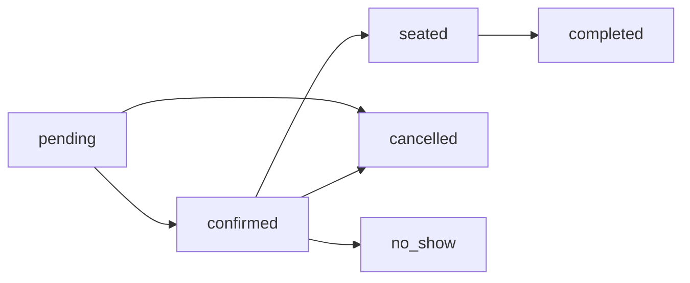

# 🍽️ TanaPOS v4 AI 預約系統開發規劃文件

## 📋 目錄
1. [現況分析](#現況分析)
2. [系統需求](#系統需求)
3. [資料庫結構](#資料庫結構)
4. [業務規則](#業務規則)
5. [技術架構](#技術架構)
6. [開發計劃](#開發計劃)
7. [測試規劃](#測試規劃)

---

## 🔍 現況分析

### 目前已具備的基礎設施

#### ✅ 餐廳基礎資料
- **餐廳資料表**: `restaurants`
- **營業時間支援**: `business_hours` (JSON格式)
  ```json
  {
    "monday": {"open": "09:00", "close": "22:00"},
    "tuesday": {"open": "09:00", "close": "22:00"},
    "wednesday": {"open": "09:00", "close": "22:00"},
    "thursday": {"open": "09:00", "close": "22:00"},
    "friday": {"open": "09:00", "close": "23:00"},
    "saturday": {"open": "09:00", "close": "23:00"},
    "sunday": {"open": "10:00", "close": "21:00"}
  }
  ```
- **系統設定**: `settings` (JSON格式，支援自訂規則)

#### ✅ 桌台管理系統
- **桌台資料表**: `tables` (26個欄位，功能完整)
- **桌台狀態**: `available`, `occupied`, `reserved`, `cleaning`, `maintenance`, `inactive`
- **容量管理**: `capacity`, `min_capacity`, `max_capacity`
- **空間資訊**: `floor_level`, `zone`, `position_x`, `position_y`
- **智能分配**: `ai_assignment_priority`, `ai_features_score`

#### ✅ 預約系統基礎架構
- **預約資料表**: `table_reservations` (22個欄位)
  - 客戶資訊: `customer_name`, `customer_phone`, `customer_email`
  - 預約詳情: `party_size`, `reservation_time`, `duration_minutes`
  - 狀態管理: `status` (`pending`, `confirmed`, `seated`, `completed`, `cancelled`, `no_show`)
  - 特殊需求: `special_requests`, `occasion`
  - 財務管理: `deposit_amount`, `deposit_paid`

#### ✅ 桌台會話管理
- **會話資料表**: `table_sessions`
- **訂單關聯**: 與 `orders` 表整合
- **狀態追蹤**: 支援即時狀態更新

---

## 🎯 系統需求

### 核心功能需求

#### 1. 📅 預約管理介面
- **預約表單**: 客戶資訊、人數、時間選擇
- **時段檢查**: 營業時間驗證、桌台可用性
- **衝突檢測**: 重複預約防護
- **預約修改**: 時間調整、取消預約

#### 2. 🕐 時間段管理
- **營業時間整合**: 依據餐廳營業時間限制
- **時段劃分**: 30分鐘為基本單位
- **緩衝時間**: 15分鐘桌台翻台時間
- **預約期限**: 7天內預約開放

#### 3. 🚥 容量控制機制
- **30分鐘接待上限**: 統一最多8位客人（包含大桌）
- **兒童成人區分**: 記錄兒童與成人數量
- **兒童椅需求**: 自動判斷兒童椅配置需求
- **桌台智能分配**: 基於總人數和兒童需求

#### 4. 📱 客戶體驗
- **預約確認**: Email/SMS 通知
- **提醒機制**: 預約前提醒
- **到店確認**: QR Code 或電話確認
- **評價系統**: 預約體驗回饋

---

## 🗄️ 資料庫結構

### 現有結構完整性評估

#### ✅ 完全滿足需求的資料表

**`table_reservations` 資料表**
```sql
- id: UUID (主鍵)
- restaurant_id: UUID (餐廳關聯)
- table_id: UUID (桌台關聯，可空)
- customer_name: 客戶姓名 ✅
- customer_phone: 電話號碼 ✅
- customer_email: Email ✅
- customer_notes: 客戶備註 ✅
- party_size: 用餐人數 ✅
- reservation_time: 預約時間 ✅
- duration_minutes: 用餐時長 (預設120分鐘) ✅
- estimated_end_time: 預估結束時間 ✅
- status: 狀態管理 ✅
- special_requests: 特殊需求 ✅
- occasion: 場合 (生日、紀念日) ✅
- deposit_amount: 訂金金額 ✅
- deposit_paid: 訂金狀態 ✅
- created_at, updated_at: 時間戳 ✅
```

**`tables` 資料表**
```sql
- capacity, min_capacity, max_capacity: 容量控制 ✅
- status: 桌台狀態管理 ✅
- current_session_id: 會話關聯 ✅
- ai_assignment_priority: 智能分配 ✅
- zone, floor_level: 空間管理 ✅
```

#### 🆕 需要新增的欄位

**`restaurants` 資料表擴展**
```sql
-- 在 settings JSON 中新增預約相關設定
{
  "reservation_settings": {
    "max_guests_per_30min": 8,        // 30分鐘最大接待人數（統一規則）
    "default_duration_minutes": 120,   // 預設用餐時長
    "buffer_minutes": 15,              // 桌台緩衝時間（確定）
    "advance_booking_days": 7,         // 提前預約天數（7天內）
    "deposit_required": false,         // 不需要訂金
    "child_chair_available": true,     // 兒童椅提供
    "reminder_hours": [24, 2]          // 提醒時間點
  }
}
```

**`table_reservations` 資料表擴展**
```sql
-- 需要新增的欄位來支援兒童成人區分
ALTER TABLE table_reservations ADD COLUMN IF NOT EXISTS adult_count INTEGER DEFAULT 0;
ALTER TABLE table_reservations ADD COLUMN IF NOT EXISTS child_count INTEGER DEFAULT 0;
ALTER TABLE table_reservations ADD COLUMN IF NOT EXISTS child_chair_needed BOOLEAN DEFAULT false;
```

---

## ⚙️ 業務規則

### 時間管理規則

#### 1. 營業時間限制
- 預約時間必須在營業時間內
- 預估結束時間不可超過營業結束時間
- 休息日不接受預約

#### 2. 容量控制規則
```javascript
// 30分鐘時段容量檢查
function checkCapacityForTimeSlot(reservationTime, partySize) {
  const timeSlot = getTimeSlot(reservationTime) // 取得30分鐘時段
  const existingReservations = getReservationsInTimeSlot(timeSlot)
  const totalGuests = existingReservations.reduce((sum, res) => sum + res.party_size, 0)
  
  return (totalGuests + partySize) <= 8 // 最大容量限制
}
```

#### 3. 桌台分配規則
```javascript
// 智能桌台分配
function assignTable(partySize, reservationTime) {
  // 1. 容量匹配 (最接近但不小於人數)
  // 2. 可用性檢查
  // 3. AI優先級排序
  // 4. 空間偏好 (zone, floor_level)
}
```

#### 4. 衝突處理規則
- **硬衝突**: 同一桌台同一時間不可重複預約
- **軟衝突**: 容量超限時提供候位機制
- **緩衝時間**: 桌台間隔15分鐘清潔時間

### 狀態轉換規則



---

## 🏗️ 技術架構

### 前端組件架構

#### 1. 預約管理頁面
```typescript
// ReservationManagementPage.tsx
interface ReservationManagement {
  // 預約列表顯示
  reservationList: Reservation[]
  // 日曆視圖
  calendarView: 'day' | 'week' | 'month'
  // 篩選功能
  filters: ReservationFilters
}
```

#### 2. 預約表單組件
```typescript
// ReservationForm.tsx
interface ReservationForm {
  customerInfo: CustomerInfo
  reservationDetails: ReservationDetails
  timeSlotSelection: TimeSlotPicker
  tablePreference?: TablePreference
}
```

#### 3. 時段選擇器
```typescript
// TimeSlotPicker.tsx
interface TimeSlotPicker {
  availableSlots: TimeSlot[]
  selectedDate: Date
  selectedTime: string
  capacityInfo: CapacityInfo
}
```

### 後端服務架構

#### 1. 預約服務 (ReservationService)
```typescript
class ReservationService {
  // 檢查可用性
  async checkAvailability(date: Date, partySize: number): Promise<AvailableSlots>
  
  // 創建預約
  async createReservation(reservation: CreateReservationRequest): Promise<Reservation>
  
  // 桌台分配
  async assignTable(reservationId: string): Promise<Table>
  
  // 容量檢查
  async checkCapacity(timeSlot: TimeSlot): Promise<CapacityStatus>
}
```

#### 2. 時間管理服務 (TimeManagementService)
```typescript
class TimeManagementService {
  // 取得可用時段
  async getAvailableTimeSlots(date: Date): Promise<TimeSlot[]>
  
  // 營業時間檢查
  async isBusinessHours(datetime: Date): Promise<boolean>
  
  // 容量計算
  async calculateCapacityForTimeSlot(timeSlot: TimeSlot): Promise<CapacityInfo>
}
```

---

## 📝 開發計劃

### Phase 1: 基礎預約功能 (週 1-2)
- [ ] 預約資料表驗證與優化
- [ ] 基礎預約 API 開發
- [ ] 預約表單組件開發
- [ ] 時段選擇器開發

### Phase 2: 容量管理系統 (週 3-4)
- [ ] 30分鐘容量限制邏輯
- [ ] 智能桌台分配算法
- [ ] 衝突檢測與處理
- [ ] 候位名單系統

### Phase 3: 管理介面 (週 5-6)
- [ ] 預約管理頁面
- [ ] 日曆視圖組件
- [ ] 預約狀態管理
- [ ] 報表與統計

### Phase 4: 進階功能 (週 7-8)
- [ ] 通知系統整合
- [ ] QR Code 確認
- [ ] 評價系統
- [ ] 手機響應式優化

---

## 🧪 測試規劃

### 單元測試
- [ ] 容量計算邏輯測試
- [ ] 時段可用性檢查測試
- [ ] 桌台分配算法測試
- [ ] 狀態轉換邏輯測試

### 整合測試
- [ ] 預約流程端對端測試
- [ ] 資料庫事務測試
- [ ] API 介面測試
- [ ] 併發預約測試

### 效能測試
- [ ] 高併發預約測試
- [ ] 資料庫查詢效能測試
- [ ] 前端響應時間測試

---

## 📊 預期效益

### 營運效益
- **提升翻台率**: 智能時段管理，最佳化桌台使用率
- **減少空置**: 30分鐘容量控制，最大化接待能力
- **客戶滿意度**: 明確預約流程，減少等待時間

### 技術效益
- **資料完整性**: 完善的預約資料追蹤
- **系統整合**: 與現有桌台、訂單系統無縫整合
- **擴展性**: 模組化設計，支援未來功能擴展

---

## 🎯 下一步行動

### 立即可執行
1. ✅ **資料庫結構已完備** - `table_reservations` 表功能完整
2. ✅ **營業時間系統已就緒** - `business_hours` 設定完善  
3. ✅ **桌台管理系統已整合** - 支援智能分配

### 需要確認的項目
1. **30分鐘容量上限 8人** - 是否適用於所有時段？
2. **緩衝時間設定** - 15分鐘是否足夠？
3. **預約提前天數** - 最多提前多少天預約？
4. **訂金機制** - 是否需要線上支付整合？
5. **特殊場合** - 生日、紀念日是否需要特別處理？

### 建議優先順序
1. **🥇 高優先級**: 基礎預約功能 + 容量管理
2. **🥈 中優先級**: 管理介面 + 智能分配  
3. **🥉 低優先級**: 通知系統 + 進階功能

---

**📋 文件狀態**: ✅ 完成資料收集，等待確認開始開發  
**📅 建立日期**: 2025年8月8日  
**👤 負責人**: TanaPOS 開發團隊  
**🔄 最後更新**: 2025年8月8日
