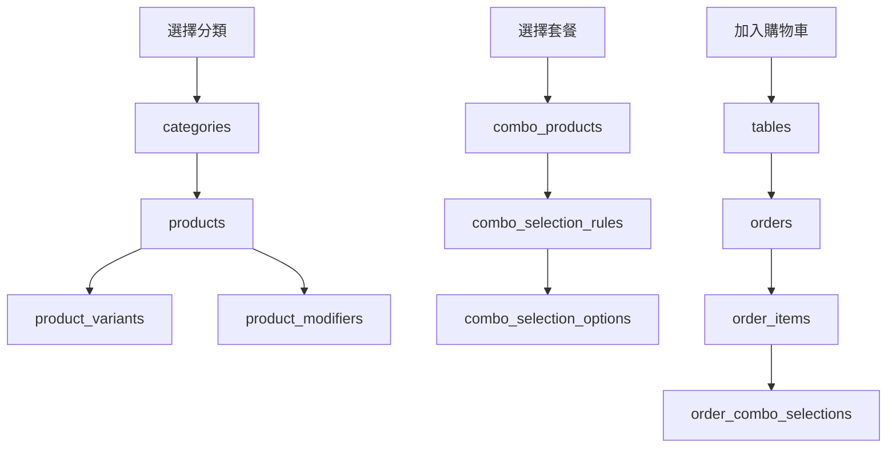
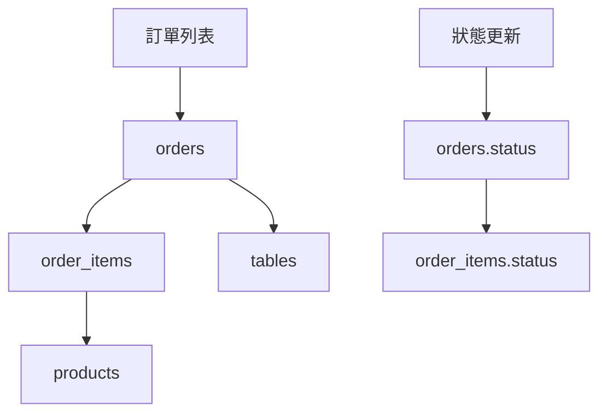
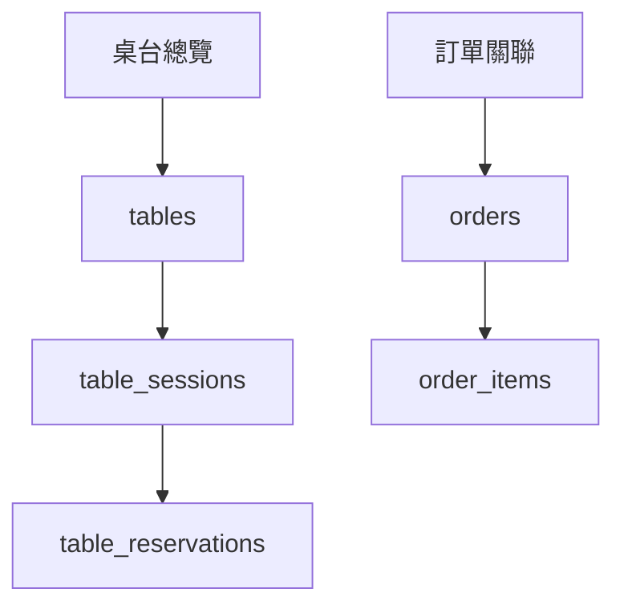

# 🗄️ TanaPOS v4 AI 資料庫架構說明文件

**文件版本**: v4.0  
**建立日期**: 2025-08-05  
**適用系統**: TanaPOS v4 AI 智慧餐廳管理系統

---

## 📋 目錄

1. [系統概述](#系統概述)
2. [各功能模組資料需求分析](#各功能模組資料需求分析)
3. [資料表詳細說明](#資料表詳細說明)
4. [功能對應關係](#功能對應關係)
5. [擴展性設計](#擴展性設計)
6. [效能優化](#效能優化)
7. [安全性設計](#安全性設計)

---

## 🎯 系統概述

TanaPOS v4 AI 是一個完整的智慧餐廳管理系統，整合了點餐、訂單管理、桌台管理、庫存控制、AI 分析等功能。本資料庫架構設計支援：

- **🍽️ 完整餐廳營運流程**
- **🤖 AI 智能分析與建議**
- **📊 即時數據分析**
- **🔄 高併發處理**
- **🚀 未來功能擴展**

---

## 🔍 各功能模組資料需求分析

### 1. 點餐系統 (OrderingPage)

#### 🎯 功能需求
- 瀏覽商品分類與商品
- 商品篩選與搜尋
- 購物車管理
- 套餐選擇
- 桌台選擇
- 備註與客製化

#### 📊 所需資料表
- `categories` - 商品分類
- `products` - 商品資訊
- `product_variants` - 商品變體
- `product_modifiers` - 商品加料選項
- `combo_products` - 套餐商品
- `combo_selection_rules` - 套餐選擇規則
- `combo_selection_options` - 套餐選項
- `tables` - 桌台資訊

#### 🔄 資料流程
```
使用者選擇分類 → 載入該分類商品 → 加入購物車 → 選擇桌台 → 提交訂單
```

---

### 2. 訂單管理 (OrdersPage)

#### 🎯 功能需求
- 訂單列表顯示
- 訂單狀態篩選
- 訂單詳情查看
- 訂單狀態更新
- 時間範圍篩選

#### 📊 所需資料表
- `orders` - 訂單主檔
- `order_items` - 訂單項目
- `order_combo_selections` - 套餐選擇記錄
- `tables` - 桌台資訊（關聯查詢）
- `products` - 商品資訊（關聯查詢）

#### 🔄 資料流程
```
載入訂單列表 → 篩選條件 → 查看訂單詳情 → 更新訂單狀態
```

---

### 3. 桌台管理 (TableManagementPage)

#### 🎯 功能需求
- 桌台狀態總覽
- 桌台狀態切換
- 桌台預約管理
- 桌台使用會話追蹤
- 清潔與維護狀態

#### 📊 所需資料表
- `tables` - 桌台主檔
- `table_reservations` - 桌台預約
- `table_sessions` - 桌台使用會話
- `orders` - 相關訂單（關聯查詢）
- `order_items` - 訂單項目（關聯查詢）

#### 🔄 資料流程
```
顯示桌台狀態 → 處理預約 → 更新桌台狀態 → 追蹤使用會話
```

---

### 4. 結帳系統 (CheckoutPage)

#### 🎯 功能需求
- 選擇結帳桌台
- 查看訂單明細
- 選擇付款方式
- 計算找零
- 生成收據

#### 📊 所需資料表
- `orders` - 訂單資訊
- `order_items` - 訂單項目
- `payments` - 付款記錄
- `receipts` - 收據記錄
- `tables` - 桌台資訊

#### 🔄 資料流程
```
選擇桌台 → 確認訂單 → 處理付款 → 更新桌台狀態 → 生成收據
```

---

### 5. 菜單管理系統

#### 🎯 功能需求
- 分類管理（增刪改查）
- 商品管理（增刪改查）
- 套餐管理（增刪改查）
- 批量操作
- 圖片上傳

#### 📊 所需資料表
- `categories` - 分類管理
- `products` - 商品管理
- `product_variants` - 商品變體
- `product_modifiers` - 商品加料
- `combo_products` - 套餐商品
- `combo_selection_rules` - 套餐規則
- `combo_selection_options` - 套餐選項

---

### 6. KDS 廚房顯示系統

#### 🎯 功能需求
- 訂單項目狀態追蹤
- 製作時間管理
- 廚房工作站分配
- 品質檢查
- 完成通知

#### 📊 所需資料表
- `orders` - 訂單資訊
- `order_items` - 訂單項目（重點）
- `products` - 商品製作資訊
- `ai_performance_metrics` - AI 效能分析

---

## 📚 資料表詳細說明

### 核心資料表

#### 🏢 restaurants
**用途**: 餐廳基本資訊設定
**關鍵欄位**:
- `tax_rate`: 稅率設定
- `service_charge_rate`: 服務費率
- `business_hours`: 營業時間 (JSON)
- `settings`: 系統設定 (JSON)

#### 📂 categories
**用途**: 商品分類管理
**關鍵欄位**:
- `parent_id`: 支援多層分類
- `path`: 分類路徑
- `ai_popularity_rank`: AI 人氣排名

#### 🍽️ products
**用途**: 商品主檔
**關鍵欄位**:
- `track_inventory`: 是否追蹤庫存
- `prep_time_minutes`: 製作時間
- `nutrition_info`: 營養資訊 (JSON)
- `ai_popularity_score`: AI 人氣分數

#### 🪑 tables
**用途**: 桌台管理
**關鍵欄位**:
- `current_session_id`: 當前使用會話
- `qr_enabled`: QR Code 點餐啟用
- `ai_assignment_priority`: AI 分配優先度

#### 📋 orders
**用途**: 訂單主檔
**關鍵欄位**:
- `order_type`: 內用/外帶/外送
- `estimated_ready_time`: 預估完成時間
- `ai_estimated_prep_time`: AI 預估製作時間

#### 🍕 order_items
**用途**: 訂單項目
**關鍵欄位**:
- `kitchen_station`: 廚房工作站
- `priority_level`: 優先度等級
- `quality_checked`: 品質檢查狀態

---

## 🔗 功能對應關係

### 點餐流程資料流


### 訂單管理資料流


### 桌台管理資料流


---

## 🚀 擴展性設計

### 1. 預留欄位設計
所有主要資料表都包含：
- `metadata` (JSONB): 結構化擴展資料
- `custom_fields` (JSONB): 自定義欄位

### 2. 階層式分類
```sql
-- 支援多層分類結構
categories.parent_id → categories.id
categories.path → 完整分類路徑
```

### 3. AI 整合擴展
- AI 分析記錄表
- AI 建議系統
- AI 效能指標追蹤

### 4. 多租戶支援
所有資料表都包含 `restaurant_id` 支援多餐廳

---

## ⚡ 效能優化

### 1. 索引設計
```sql
-- 複合索引優化常用查詢
CREATE INDEX idx_orders_restaurant_date ON orders(restaurant_id, created_at DESC);
CREATE INDEX idx_products_category_available ON products(category_id, is_available);
CREATE INDEX idx_order_items_status_time ON order_items(status, created_at);
```

### 2. 視圖優化
```sql
-- 訂單摘要視圖
CREATE VIEW order_summary AS 
SELECT o.*, COUNT(oi.id) as item_count 
FROM orders o 
LEFT JOIN order_items oi ON o.id = oi.order_id 
GROUP BY o.id;
```

### 3. 分割設計考量
大量歷史資料可考慮：
- 按時間分割 orders 表
- 按餐廳分割多租戶資料

---

## 🔒 安全性設計

### 1. 行級安全 (RLS)
```sql
-- 啟用行級安全
ALTER TABLE restaurants ENABLE ROW LEVEL SECURITY;
ALTER TABLE orders ENABLE ROW LEVEL SECURITY;
```

### 2. 資料加密
- 敏感欄位加密儲存
- 信用卡資訊遮罩處理

### 3. 稽核追蹤
- `audit_logs` 記錄所有異動
- `error_logs` 記錄系統錯誤

---

## 📊 關鍵統計查詢

### 1. 即時營運統計
```sql
-- 今日訂單統計
SELECT 
    COUNT(*) as total_orders,
    SUM(total_amount) as total_revenue,
    AVG(total_amount) as avg_order_value
FROM orders 
WHERE DATE(created_at) = CURRENT_DATE;
```

### 2. 桌台利用率
```sql
-- 桌台使用率統計
SELECT 
    status,
    COUNT(*) as count,
    ROUND(COUNT(*) * 100.0 / SUM(COUNT(*)) OVER(), 2) as percentage
FROM tables 
GROUP BY status;
```

### 3. 熱門商品分析
```sql
-- 熱門商品排行
SELECT 
    p.name,
    SUM(oi.quantity) as total_sold,
    SUM(oi.total_price) as total_revenue
FROM order_items oi
JOIN products p ON oi.product_id = p.id
WHERE oi.created_at >= CURRENT_DATE - INTERVAL '7 days'
GROUP BY p.id, p.name
ORDER BY total_sold DESC
LIMIT 10;
```

---

## 🛠️ 維護與最佳化建議

### 1. 定期維護
- 定期清理過期的 AI 分析記錄
- 歸檔舊的訂單資料
- 重建統計資訊

### 2. 監控重點
- 查詢效能監控
- 資料表大小追蹤
- 索引使用率分析

### 3. 備份策略
- 每日全量備份
- 即時交易日誌備份
- 重要資料表的增量備份

---

## 📞 聯絡資訊

**開發團隊**: TanaPOS v4 AI Development Team  
**文件維護**: Database Architecture Team  
**更新日期**: 2025-08-05

---

*此文件涵蓋了 TanaPOS v4 AI 系統的完整資料庫架構，包含35+個資料表，支援所有核心功能，並預留未來擴展空間。*
